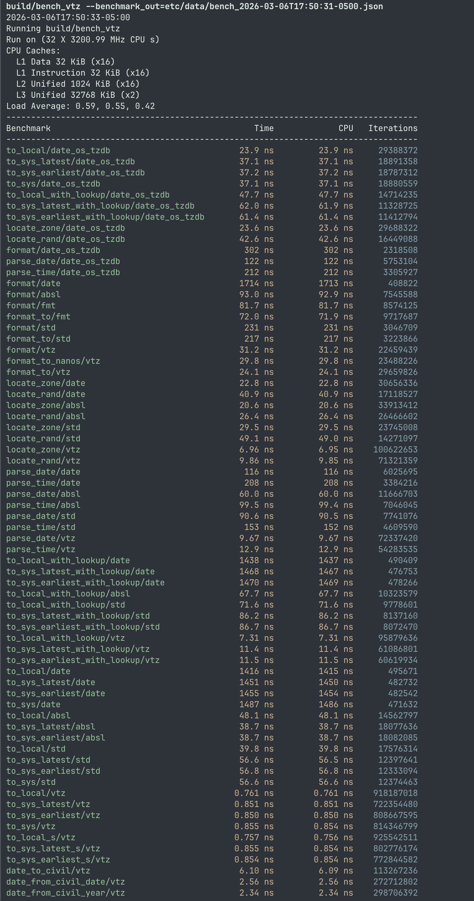

# vtz

vtz is a timezone library which provides unparalleled performance and a clean
API for both regular applications, and for data-heavy workflows where scale or
latency is a concern.

Does your database need to handle timezones correctly? Does your application
need to be able to parse or format timestamps en masse? Are you doing modeling
which depends on local time within a particular region?

If so, then vtz is the right library for you.

**vtz is 30-60x faster at timezone conversions than the next leading
competitor.** It's faster at looking up offsets, converting UTC to local,
converting local to UTC, parsing timestamps, formatting timestamps, and it's
faster at looking up a timezone based on a name. Take a look at
[the performance section](#performance) for a full comparison.

Most timezones are not a fixed offset from UTC. Clocks change because of
daylight savings time, because of legislative change, or based on the preference
of local governments. In the face of this complexity, many timezone libraries
simply fall back on a binary search across the transition times.

vtz achieves its performance gains by instead using a block-based lookup table,
with blocks indexable by bit shift. Blocks span a period of time tuned to fit
the minimum spacing between transitions for a given zone. This strategy is
extended to enable lookups for all possible input times by taking advantage of
periodicities within the calendar system and tz database rules to map
out-of-bounds inputs to blocks within the table.

For a more thorough explanation of how the underlying algorithm works, check out
[How it Works: vtz's algorithm for timezone conversions](#how-it-works-vtzs-algorithm-for-timezone-conversions).

## Getting Started

For a quick introduction on how to use the library, take a look at [the vtz
TLDR][tldr]. Or, for an extended introduction, [read vtz: A Guided Tour][tour].
Source code for these can be found in `examples/src`.

`vtz::time_zone` is designed for compatibility with the
[`std::chrono::time_zone`] API, with some additional functions added for
convenience.

```cpp
// Locate a timezone
auto tz = vtz::locate_zone( "America/New_York" );

// Get the current timezone
auto tz_here = vtz::current_zone();

// Convert to local time
auto t = std::chrono::sys_seconds( ... );
auto local = tz->to_local( t );

// Convert back to UTC
auto t2 = tz->to_sys( local );

// Get current offset from UTC, at time t
auto offset = tz->offset( t );

// Format a timestamp. Uses strftime format specifiers
std::string t_str = tz->format( "%F %T %Z", t );
```

[docs/vtz_tldr.md]: docs/vtz_tldr.md
[tldr]: docs/vtz_tldr.md
[tour]: docs/vtz_a_guided_tour.md
[`std::chrono::time_zone`]:
  https://en.cppreference.com/w/cpp/chrono/time_zone.html

## Using vtz in your project

If you use CMake, the fastest way to use `vtz` in your own project is with
[CPM]:

```cmake
CPMAddPackage("gh:voladynamics/vtz@1.0.0")

target_link_libraries(your_app PRIVATE vtz::vtz)
```

This will automatically download and configure `vtz` as part of your project's
configuration.

<details>
<summary>Tip: When Using CPM, enable offline builds with CPM_SOURCE_CACHE</summary>

<br>

To avoid repeat downloads, and to enable offline builds, I recommend configuring
the `CPM_SOURCE_CACHE` env variable (or set it in your CMakeLists.txt):

```sh
export CPM_SOURCE_CACHE=$HOME/.local/.cpm
```

This should be placed in your `.bashrc` or `.zshrc`.

---

</details>

If you install `vtz`, you can also use it with [`find_package`]:

```cmake
find_package(vtz)

target_link_libraries(your_app PRIVATE vtz::vtz)
```

[`find_package`]: https://cmake.org/cmake/help/latest/command/find_package.html
[CPM]: https://github.com/cpm-cmake/CPM.cmake

## Building, Running, and Installing

To build everything (the library, tests, and benchmarks), use:

```sh
cmake -B build -G Ninja -DCMAKE_BUILD_TYPE=Release && cmake --build build
```

To build _only_ the library, add `-DVTZ_ONLY=ON`:

```sh
cmake -B build -G Ninja -DCMAKE_BUILD_TYPE=Release -DVTZ_ONLY=ON && cmake --build build
```

### Dependencies

You do not need to install any packages on your system in order to build vtz.
The library itself has only one dependency, [`ankerl::unordered_dense`][ankerl].
This is a very fast hash map implementation which is used as the KV store for
`vtz::locate_zone( tzname )`.

[ankerl]: https://github.com/martinus/unordered_dense

Because `ankerl::unordered_dense` is header-only, a copy of the headers has been
provisioned at `etc/3rd/ankerl`.

If `vtz` is used as a sub-component of another library (eg, with
`add_subdirectory`, or when included with [CPM]), vtz will not build tests; it
will not build benchmarks; and it will not download anything: the build becomes
hermetic.

If you _do_ want to build tests and benchmarks, vtz will use [CPM] to download
test- and benchmark-related dependencies for ease of use.

### Installation

Install with:

```sh
cmake --install build --prefix [path]
```

If installed on a directory searched by CMake, `vtz` can be discovered with
`find_package`.

## Performance

Robust and reliable performance is a key focus of vtz.

Timezone conversions themselves are **52-67x faster than gcc's implementation of
the [`std::chrono::time_zone`][chrono-timezone]**, 45-63x faster than Google
[abseil][abseil], and 31x - 1800x(!!!) faster than
[`date::time_zone`][hinnant-date] from the [the Hinnant date
library][hinnant-date].

When parsing timestamps, vtz achieves an **11x speedup over
[`std::chrono::parse()`]**, a 7x speedup over abseil, and it's some 16x faster
than [`date::parse`][hinnant-date].

When formatting timestamps, vtz is **2.6 - 3.1x faster than
[`libfmt`][libfmt]**, 2.9x faster than abseil, and 10 to 50x faster than
[`date::format`][hinnant-date].

And for Timezone lookups based on a name (eg,
`vtz::locate_zone( "America/New_York" )`), vtz achieves a 2.6 to 3x speedup over
the nearest competing library.

This table of benchmarks has a full comparison. Benchmarks were generated from
running `bench_vtz` on a Ryzen 9 7950X, and all libraries were compiled with
`-DCMAKE_BUILD_TYPE=Release` on gcc 14.2.1.

|               | vtz              | std           | absl   | date         | date/os tzdb  | fmt    |
| ------------- | ---------------- | ------------- | ------ | ------------ | ------------- | ------ |
| `to_local`    | 0.761ns          | 39.8ns        | 48.1ns | 1420ns       | 23.9ns        |        |
| `to_sys`      | 0.852 ± 0.002 ns | 56.6 ± 0.1 ns | 38.7ns | 1470 ± 20 ns | 37.2 ± 0.1 ns |        |
| `format`      | 31.2ns           | 231ns         | 92.9ns | 1710ns       | 302ns         | 81.7ns |
| `format_to`   | 24.1ns           | 217ns         |        |              |               | 71.9ns |
| `parse_date`  | 9.67ns           | 90.5ns        | 60.0ns | 116ns        | 122ns         |        |
| `parse_time`  | 12.9ns           | 152ns         | 99.4ns | 208ns        | 212ns         |        |
| `locate_zone` | 6.95ns           | 29.5ns        | 20.6ns | 22.8ns       | 23.6ns        |        |
| `locate_rand` | 9.85ns           | 49.0ns        | 26.4ns | 40.9ns       | 42.6ns        |        |

**Benchmark descriptions:**

- `to_local` measures the time to perform a UTC to Local conversion
- `to_sys` measures the inverse - a Local Time to UTC conversion
- `format` measures the time to format a timestamp, returning a `std::string`
- `format_to` measures the time to format a timestamp to a buffer of `char`
- `parse_date` measures the time to parse a date
- `parse_time` measures the time to parse a timestamp
- `locate_zone` measures the time to get a timezone object, based on the name
- `locate_rand` measures the time to get a timezone object, with a different
  random input name each time

From the above benchmarks, we obtain a table measuring vtz's relative speedup:

|               | vtz v. std | vtz v. absl | vtz v. date   | vtz v. date/os tzdb | vtz v. fmt |
| ------------- | ---------- | ----------- | ------------- | ------------------- | ---------- |
| `to_local`    | 52.3x      | 63.2x       | 1860x         | 31.4x               |            |
| `to_sys`      | 66x - 67x  | 45x - 46x   | 1707x - 1739x | ~43.6x              |            |
| `format`      | 7.40x      | 2.98x       | 55.0x         | 9.69x               | 2.62x      |
| `format_to`   | 9.02x      |             |               |                     | 2.98x      |
| `parse_date`  | 9.36x      | 6.20x       | 12.0x         | 12.6x               |            |
| `parse_time`  | 11.8x      | 7.71x       | 16.1x         | 16.4x               |            |
| `locate_zone` | 4.24x      | 2.96x       | 3.28x         | 3.39x               |            |
| `locate_rand` | 4.98x      | 2.68x       | 4.15x         | 4.32x               |            |

Here,

- `std` corresponds to gcc's implementation of `std::time_zone` in the C++
  standard library
- `absl` is Google Abseil,
- `date` is the Hinnant date library, compiled with default settings,
- `date/os tzdb` is the Hinnant date library, compiled using `USE_OS_TZDB=1`.
- `fmt` is libfmt (it's not a timezone library, but it supports formatting for
  timestamps).

vtz does all of this on equal footing: `vtz::parse()` and `vtz::format()` can
handle arbitrary format strings following [`strftime`]/[`strptime`] conventions
with regard to formatting; format strings are parsed at runtime (not
hardcoded!), and timezone conversions such as UTC-to-local with `to_local()` and
local-to-UTC `to_sys()` match the C++ standard library's API conventions.

We have two separate benchmarks for the Hinnant date library because `date` uses
wholly different implementations for `date::time_zone`, depending on if
`USE_OS_TZDB` is enabled.

<details>
<summary>More information on performance discrepancies with the Hinnant date library</summary>

<br>

Hinnant's date and timezone library is significantly slower when
`USE_SYSTEM_TZ_DB=OFF`. This is the default setting, and within the
`date::time_zone` source code it implies `USE_OS_TZDB=0`.

Under this setting, the Hinnant date library directly evaluates the rules
present in the tz database every time a timezone conversion is requested.

With `USE_OS_TZDB=1`, `date::time_zone` uses a much more efficient binary-search
based approach. This puts it on-par with `std::chrono::time_zone` and
`absl::TimeZone` (but still 30-40x slower than vtz).

However, in this mode, the Hinnant date library does NOT support loading from
the tz database directly. It _only_ supports loading from compiled tzif files,
such as those present at `/usr/share/zoneinfo/`.

This causes two sets of problems:

1. It means that anyone attempting to run an application on an older system with
   out-of-date zoneinfo is out of luck, and must resort to the slower
   implementation.
2. Anyone running on Windows in particular must _also_ resort to the slower
   implementation - there are no tzif files available for use.

If you do not (1) know about the poor defaults, and (2) exist on a system with
compiled tzif files, any timezone conversions end up slow-by-default.

This has been the source of significant headaches.

By comparison - vtz supports reading from either tzif files, or from the tz
database itself, with no difference in performance. Users can opt-in to reading
from the tz database at runtime by setting `VTZ_TZDATA_PATH=/path/to/tzdata`.

---

</details>

### Running benchmarks

To reduce variability, benchmarks were run with the frequency governor set to
`performance`.

```sh
sudo cpupower frequency-set --governor performance
```

This step is entirely optional, and does not actually appear to have an impact
on the performance of vtz if frequency scaling is enabled.

Benchmarks can be run with:

```sh
build/bench_vtz --benchmark_out=path/to/output.json
```

vtz uses google benchmark, and any of Google Benchmark's CLI arguments can be
used here.

<details>
<summary>Benchmark Arguments</summary>

```
$ build/bench_vtz --help
benchmark [--benchmark_list_tests={true|false}]
          [--benchmark_filter=<regex>]
          [--benchmark_min_time=`<integer>x` OR `<float>s` ]
          [--benchmark_min_warmup_time=<min_warmup_time>]
          [--benchmark_repetitions=<num_repetitions>]
          [--benchmark_dry_run={true|false}]
          [--benchmark_enable_random_interleaving={true|false}]
          [--benchmark_report_aggregates_only={true|false}]
          [--benchmark_display_aggregates_only={true|false}]
          [--benchmark_format=<console|json|csv>]
          [--benchmark_out=<filename>]
          [--benchmark_out_format=<json|console|csv>]
          [--benchmark_color={auto|true|false}]
          [--benchmark_counters_tabular={true|false}]
          [--benchmark_context=<key>=<value>,...]
          [--benchmark_time_unit={ns|us|ms|s}]
          [--v=<verbosity>]
```

</details>

Tables were generated with

```sh
uv run --python 3.11 etc/scripts/make_bm_table.py etc/data/bench_2026-03-06T17:50:31-0500.json
```

`make_bm_table.py` is a script that processes the benchmark data, and produces
two tables showing the raw performance numbers, as well as vtz's relative
performance. Settings for the script can be found in `bm_table_config.toml`.

In some cases, there were multiple benchmarks for a function. Eg, `to_sys` has
`to_sys_latest_(vtz|absl|hinnant|...)`, `to_sys_earliest_(...)`, and
`to_sys_(...)` (where `time_zone::to_sys` will throw on ambiguous/nonexistent
local times). In this case, the measurement table contains an error bar.

Only local times which uniquely map to a UTC timestamp were tested for the
variant of `to_sys` which throws. If exceptions are a source of concern for your
application, I recommend disambiguating by invoking `to_sys` with
`vtz::choose::latest` or `vtz::choose::earliest`. This variant will not throw.

If you have [`uv`] and [`just`] installed, then you can use `just run_bench` to
run benchmarks and generate a set of markdown tables comparing vtz versus other
timezone libraries for your system.

[`std::chrono::parse()`]: https://en.cppreference.com/w/cpp/chrono/parse.html
[`uv`]: https://docs.astral.sh/uv/
[`just`]: https://github.com/casey/just

```sh
just run_bench
```

Note that some compilers still lack an implementation for
[`std::chrono::time_zone`]. If your standard library does not support
[`std::chrono::time_zone`], then `chrono` will be excluded from the benchmarks.

[`std::chrono::time_zone`]:
  https://en.cppreference.com/w/cpp/chrono/time_zone.html
[chrono-timezone]: https://en.cppreference.com/w/cpp/chrono/time_zone.html
[abseil]: https://github.com/abseil/abseil-cpp
[cctz]: https://github.com/google/cctz
[libfmt]: https://github.com/fmtlib/fmt
[`strftime`]: https://man7.org/linux/man-pages/man3/strftime.3.html
[`strptime`]: https://man7.org/linux/man-pages/man3/strptime.3.html

<br>

<details>
<summary>Raw Benchmark Output</summary>

<br>

```sh
build/bench_vtz --benchmark_out=etc/data/bench_2026-03-06T17:50:31-0500.json
2026-03-06T17:50:33-05:00
Running build/bench_vtz
Run on (32 X 3200.99 MHz CPU s)
CPU Caches:
  L1 Data 32 KiB (x16)
  L1 Instruction 32 KiB (x16)
  L2 Unified 1024 KiB (x16)
  L3 Unified 32768 KiB (x2)
Load Average: 0.59, 0.55, 0.42
-----------------------------------------------------------------------------------
Benchmark                                         Time             CPU   Iterations
-----------------------------------------------------------------------------------
to_local/date_os_tzdb                          23.9 ns         23.9 ns     29388372
to_sys_latest/date_os_tzdb                     37.1 ns         37.1 ns     18891358
to_sys_earliest/date_os_tzdb                   37.2 ns         37.2 ns     18787312
to_sys/date_os_tzdb                            37.1 ns         37.1 ns     18880559
to_local_with_lookup/date_os_tzdb              47.7 ns         47.7 ns     14714235
to_sys_latest_with_lookup/date_os_tzdb         62.0 ns         61.9 ns     11328725
to_sys_earliest_with_lookup/date_os_tzdb       61.4 ns         61.4 ns     11412794
locate_zone/date_os_tzdb                       23.6 ns         23.6 ns     29688322
locate_rand/date_os_tzdb                       42.6 ns         42.6 ns     16449088
format/date_os_tzdb                             302 ns          302 ns      2318508
parse_date/date_os_tzdb                         122 ns          122 ns      5753104
parse_time/date_os_tzdb                         212 ns          212 ns      3305927
format/date                                    1714 ns         1713 ns       408822
format/absl                                    93.0 ns         92.9 ns      7545588
format/fmt                                     81.7 ns         81.7 ns      8574125
format_to/fmt                                  72.0 ns         71.9 ns      9717687
format/std                                      231 ns          231 ns      3046709
format_to/std                                   217 ns          217 ns      3223866
format/vtz                                     31.2 ns         31.2 ns     22459439
format_to_nanos/vtz                            29.8 ns         29.8 ns     23488226
format_to/vtz                                  24.1 ns         24.1 ns     29659826
locate_zone/date                               22.8 ns         22.8 ns     30656336
locate_rand/date                               40.9 ns         40.9 ns     17118527
locate_zone/absl                               20.6 ns         20.6 ns     33913412
locate_rand/absl                               26.4 ns         26.4 ns     26466602
locate_zone/std                                29.5 ns         29.5 ns     23745008
locate_rand/std                                49.1 ns         49.0 ns     14271097
locate_zone/vtz                                6.96 ns         6.95 ns    100622653
locate_rand/vtz                                9.86 ns         9.85 ns     71321359
parse_date/date                                 116 ns          116 ns      6025695
parse_time/date                                 208 ns          208 ns      3384216
parse_date/absl                                60.0 ns         60.0 ns     11666703
parse_time/absl                                99.5 ns         99.4 ns      7046045
parse_date/std                                 90.6 ns         90.5 ns      7741076
parse_time/std                                  153 ns          152 ns      4609590
parse_date/vtz                                 9.67 ns         9.67 ns     72337420
parse_time/vtz                                 12.9 ns         12.9 ns     54283535
to_local_with_lookup/date                      1438 ns         1437 ns       490409
to_sys_latest_with_lookup/date                 1468 ns         1467 ns       476753
to_sys_earliest_with_lookup/date               1470 ns         1469 ns       478266
to_local_with_lookup/absl                      67.7 ns         67.7 ns     10323579
to_local_with_lookup/std                       71.6 ns         71.6 ns      9778601
to_sys_latest_with_lookup/std                  86.2 ns         86.2 ns      8137160
to_sys_earliest_with_lookup/std                86.7 ns         86.7 ns      8072470
to_local_with_lookup/vtz                       7.31 ns         7.31 ns     95879636
to_sys_latest_with_lookup/vtz                  11.4 ns         11.4 ns     61086801
to_sys_earliest_with_lookup/vtz                11.5 ns         11.5 ns     60619934
to_local/date                                  1416 ns         1415 ns       495671
to_sys_latest/date                             1451 ns         1450 ns       482732
to_sys_earliest/date                           1455 ns         1454 ns       482542
to_sys/date                                    1487 ns         1486 ns       471632
to_local/absl                                  48.1 ns         48.1 ns     14562797
to_sys_latest/absl                             38.7 ns         38.7 ns     18077636
to_sys_earliest/absl                           38.7 ns         38.7 ns     18082085
to_local/std                                   39.8 ns         39.8 ns     17576314
to_sys_latest/std                              56.6 ns         56.5 ns     12397641
to_sys_earliest/std                            56.8 ns         56.8 ns     12333094
to_sys/std                                     56.6 ns         56.6 ns     12374463
to_local/vtz                                  0.761 ns        0.761 ns    918187018
to_sys_latest/vtz                             0.851 ns        0.851 ns    722354480
to_sys_earliest/vtz                           0.850 ns        0.850 ns    808667595
to_sys/vtz                                    0.855 ns        0.854 ns    814346799
to_local_s/vtz                                0.757 ns        0.756 ns    925542511
to_sys_latest_s/vtz                           0.855 ns        0.854 ns    802776174
to_sys_earliest_s/vtz                         0.854 ns        0.854 ns    772844582
date_to_civil/vtz                              6.10 ns         6.09 ns    113267236
date_from_civil_date/vtz                       2.56 ns         2.56 ns    272712802
date_from_civil_year/vtz                       2.34 ns         2.34 ns    298706392
```



---

</details>

## How It Works: vtz's algorithm for timezone conversions

Clock transitions (such as the transition into or out of daylight savings time)
have some degree of regularity, but this regularity is imperfect. Many libraries
resort to some variant of a binary search across a range of transition times, or
they attempt to evaluate the rules for when daylight savings time starts/ends
directly (Hinnant's date library does this by default, which is why it's so much
slower).

Rather than performing a binary search, vtz divides time into blocks of size
$2^k$ seconds, where the block size is chosen so that there are _at most_ 1
transition per block, _independent_ of whether the input time is a local time,
or a UTC time.

For each zone, vtz records the block size, $k$, and then indexes into the
corresponding block by taking the input time and performing a bitshift:
`input_time >> k`. Most timezones end up with a block size of `k=23`,
corresponding to 8388608 seconds, or roughly 97 days.

Timezones such as UTC, which have no transitions at all, may use a maximally
large block size so that the whole table only takes up a couple bytes.

Each block records three pieces of information:

1. The actual time of a suitably near transition point, as a unix timestamp in
   seconds (8 bytes)
2. The UTC offset prior to the transition, in seconds (4 bytes)
3. The UTC offset after the transition, in seconds (4 bytes)

This means that each block contains 16 bytes per ~97-day period, and the
entirety of the offset table for a zone that has two clock transitions per year
fits into some ~30kb.

What's more, inputs that are close together in time are _also_ likely to be
close together in memory, ensuring very good cache locality (only a fraction of
those 30kb will actually need to be loaded into cache, unless you're dealing
with historical dates, or dates far in the future).

For obtaining the offset (or converting to local time), it is trivial to (1)
look up the correct block, (2) compare against the transition point, and then
(3) branchlessly select between two of the offsets.

<details>
<summary>Lookup algorithm, UTC to Local Time</summary>

This is the raw code to do a lookup of information such as the current offset
from UTC:

```cpp
/// if t >= tt[i], return the low 32 bits of bb[i], else obtain the hi
/// 32 bits of bb[i], where i = t >> g
///
/// Treats the result as a signed integer, and sign-extends it back to
/// 64 bits.
VTZ_INLINE constexpr i64 lookup( i64 t ) const noexcept {
    i64  i         = t >> g;
    bool select_lo = t < tt[i];
    u64  block     = bb[i];
    return i64( block << ( int( select_lo ) << 5 ) ) >> 32;
}
```

You can use this offset to convert a unix timestamp representing UTC time, to a
timestamp representing local time. `tt_utc` is the table of UTC offsets.

```cpp
/// For a given system time T, represented as "offsets from UTC", return
/// the timezone's current offset from UTC, in seconds.
VTZ_INLINE sec_t to_local_s( sec_t t ) const noexcept {
    // If the time is in-bounds we can use the lookup table
    if( u64( t ) + tz0_ <= tz_max_ ) VTZ_LIKELY
        return t + tt_utc.lookup( t );

    // t is _early_: use initial zone state
    if( t < 0 ) return t + tt_utc.initial();

    // use zone symmetry to compute state for equivalent time
    return t + tt_utc.lookup( get_cyclic( t, cycle_time ) );
}
```

---

</details>

<br>

Converting from local time back to UTC is more involved, but it can be done in a
similarly efficient manner - the primary caveat is that you need to be able to
determine if an input local time is either _ambiguous_ or _nonexistent_.

When the clock falls back, you end up with a set of local times that could refer
to time before _or after_ the change. For instance, 1:30AM Eastern Time on
Sunday, November 1st is ambiguous because it could refer to 1:30AM EDT (before
change) or 1:30AM EST (after change).

Similarly, when a clock jumps forwards, you end up with nonexistent local times.
2:30AM Eastern Time on Sunday, March 8th is nonexistent because the clock jumps
forward from 1:59:59AM to 3:00AM.

<details>
<summary>Lookup algorithm Local to UTC, with handling of ambiguous/non-existent times</summary>

`vtz::time_zone::to_sys( t )` uses `vtz::time_zone::to_sys_s( t )` under the
hood, which takes an input time as 64-bit count of UTC seconds since the epoch.

This performs a lookup with two values:

1. The lookup time `t`, which is the time for which we want to do the
   conversion, and
2. The _key_ `t_key`. This will be used to find a block in the lookup table
   containing the transition time, as well as the before and after offset.

For times within the table, `t == t_key`, so `t` is passed for both values.

For out of bounds times, `get_cyclic` is used to resolve an appropriate key
time.

```cpp
/// Converts an input local time to UTC. Throws an exception if the
/// given input time is non-existent
VTZ_INLINE sec_t to_sys_s( sec_t t ) const {
    // If the time is in-bounds, we can use the lookup table
    if( u64( t ) + tz0_ <= tz_max_ ) VTZ_LIKELY
        return _lookup_utc_or_throw( t, t );

    // t is _early_: use initial zone state
    if( t < 0 ) return t - tt_utc.initial();

    // use zone symmetry to compute state for equivalent time
    return _lookup_utc_or_throw( get_cyclic( t, cycle_time ), t );
}
```

`_lookup_utc_or_throw` works by computing two times `when1` and `when2` that
partition local time into 3 separate periods surrounding the transition point.

- if `t_key` is before `when1`, it must be unique (not ambiguous or
  nonexistent), and we know we can use the earlier offset.
- if `t_key` is on or after `when2`, it also must be unique, and we can use the
  later offset.

Otherwise, times in-between are either ambiguous or nonexistent, and we throw in
these cases.

```cpp
// Used to implement `to_sys( t )` (throwing version)
sec_t _lookup_utc_or_throw( sec_t t_key, sec_t t ) const {
    auto ent = tt_utc.get( t_key );
    /// offset from UTC before transition time
    i64 off_pre = ent.lo();
    /// offset from UTC on or after transition time
    i64 off_post = ent.hi();
    /// If the clock falls back, then `off_post` is the earlier time
    bool falls_back = off_post < off_pre;

    auto off1 = falls_back ? off_post : off_pre; ///< Earlier offset
    auto off2 = falls_back ? off_pre : off_post; ///< Later offset

    auto when1 = ent.t + off1; ///< Local time when transition starts
    auto when2 = ent.t + off2; ///< Local time when the transition ends

    /// Time is unique and before ambiguous/nonexistent time period
    bool unique_before = t_key < when1;
    /// Time is unique and after ambiguous/nonexistent time period
    bool unique_after = when2 <= t_key;

    bool is_unique = unique_before || unique_after;
    auto off       = unique_before ? off_pre : off_post;

    // This is the happy path. The input time is unique, so we just
    // subtract the offset
    if( is_unique ) VTZ_LIKELY { return t - off; }

    // If we fall back, we repeat some period of time, so the input
    // local time must be ambiguous.
    //
    // Otherwise, when jumping forward, some period of local time is
    // non-physical. Eg, 2:30 AM EST on March 8th simply doesn't exist
    // in America/New_York, because the clock jumps from 1:59:59AM to
    // 3:00:00AM
    if( falls_back )
        throw std::runtime_error( "ambiguous local time" );
    else
        throw std::runtime_error( "nonexistent local time" );
}
```

For a non-throwing version, use `to_sys( t, vtz::choose::{earliest,latest} )`.
In the event of ambiguity, `choose::earliest` returns the earliest possible UTC
timestamp corresponding to the input local time, and `choose::latest` returns
the latest possible timestamp corresponding to the input. nonexistent times are
all treated as referring to the point in time when the transition actually
occurs.

---

</details>

<br>

Other information (such as the timezone abbreviation at a particular time) is
handled in a similarly efficient manner - the primary difference is that, rather
than holding the UTC offset, the second and third elements of the block are
indices into a table of timezone abbreviations.

### Handling dates far in the future, or in the past

The above lookup table is very fancy, but it still needs to be finite in size.
Thankfully, timezones (as specified in the tz database) observe two properties:

1. The zone has a constant offset (and abbreviation) for times prior to the
   standardization of time within the given zone (eg, November 18, 1883 for the
   US)
2. All timezone rules in the tz database are implemented based on the Gregorian
   Calendar, aka the Civil Calendar, which is the de facto international
   standard (and the one you are likely to be familiar with in everyday life).

The Civil Calendar follows a 400 year cycle due to the rules for adding leap
days: a leap day is to be added every four years, except for years divisible by
100 which are not also divisible by 400 (so centuries are skipped, except for
1200, 1600, 2000, 2400, etc).

This has the benefit that every 400 year period contains the exact same number
of days, regardless of when the period starts. That is, 146097 days per 400
years, exactly.

Conveniently, 146097 is divisible by 7. This means that weekdays _also_ repeat
on a 400 year cycle.

**What does this mean?** Well, it means that every year has the exact same
_layout_ as the year 400 years prior, and the year 400 years hence. If today is
Wednesday on the 4th of March, then 400 years from now, it shall also be a
Wednesday, March 4th. And if today were the Second Sunday of March, then it
shall also be the Second Sunday of March 400 years hence.

If daylight savings time occurs within a particular zone, then the rules for
when it occurs (as represented by the tz database) can either describe:

- a particular day of the year (eg, the 153rd day of the year)
- a particular day of a month (eg, August 3rd)
- the n-th weekday in some month (eg, 2nd Sunday in March)
- the last weekday in some month (eg, last Friday in April)

_All of these follow a 400-year cycle._

Therefore, for times after the most recent historical rule change for the zone,
a timezone's offset, its abbreviation, and all the other properties we care
about _also follow a 400 year cycle_.

We take advantage of this symmetry in various forms throughout the
implementation.

```cpp
// (from implementation)

VTZ_INLINE sec_t offset_s( sec_t t ) const noexcept {
    // If the time is in-bounds, use the lookup table
    if( u64( t ) + tz0_ <= tz_max_ ) VTZ_LIKELY
        return tt_utc.lookup( t );

    // t is _early_: use initial zone state
    if( t < 0 ) return tt_utc.initial();

    // use zone symmetry to compute state for equivalent time
    return tt_utc.lookup( get_cyclic( t, cycle_time ) );
}
```

## Acknowledgements

I would like to acknowledge Arthur David Olson, Paul Eggert, and the many
volunteers and contributors to the [tz database][tz-database-wiki]. Their
efforts to standardize and document the chaos that is global timekeeping has
proven invaluable for allowing innumerable other projects to properly handle
timezones.

[_Theory and pragmatics of the `tz` code and data_][tz-theory] is itself an
excellent resource for understanding how timezones work, and [_How to Read the
tz Database Source Files_][tz-how-to] was my primary reference when implementing
vtz's parsing logic.

[`ankerl::unordered_dense`][ankerl] is an excellent and performant
implementation of a flat hash-map implementation, and the
[benchmarks][ankerl-bench] carried out by Martin Leitner-Ankerl are solid and
well-documented.

[CPM: the CMake Package Manager][CPM] is invaluable for fast prototyping, and
for quickly adding dependencies to a project.

And finally, the [Hinnant Date Library][hinnant-date] exists as the source of
inspiration for the timezone library incorporated into the C++ standard, and
despite the performance issues it exposes with regard to timezone conversions in
particular, it has proven reliable. (The `date` side of things is otherwise very
performant.)

Hinnant's work, [_`chrono`-Compatible Low-Level Date Algorithms_][ll-date], is
also a fantastic read, and the date algorithms described there form the basis of
many of the date algorithms which vtz uses for formatting, parsing, and for
ingestion of the tz database itself.

The work goes out of its way to explain and document the algorithms used, and
these algorithms allow conversions between Unix Time and human-readable dates to
be performed _without_ lookup tables.

[tz-how-to]: https://data.iana.org/time-zones/tzdb-2022g/tz-how-to.html
[tz-theory]: https://data.iana.org/time-zones/tzdb-2022b/theory.html
[tz-database]: https://www.iana.org/time-zones
[tz-database-wiki]: https://en.wikipedia.org/wiki/Tz_database
[ankerl-bench]: https://martin.ankerl.com/2022/08/27/hashmap-bench-01/
[hinnant-date]: https://github.com/HowardHinnant/date
[ll-date]: https://howardhinnant.github.io/date_algorithms.html
